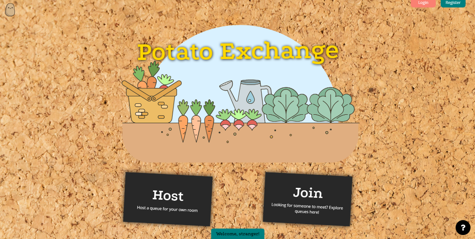
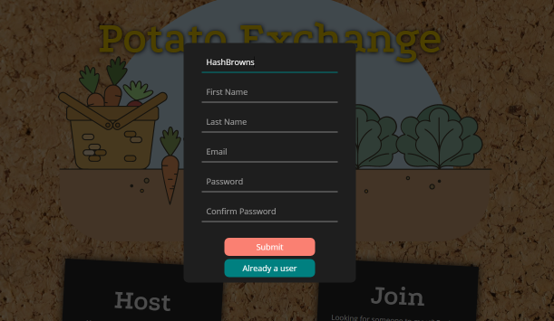
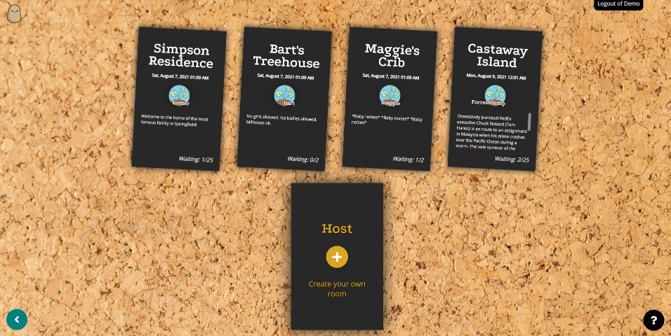
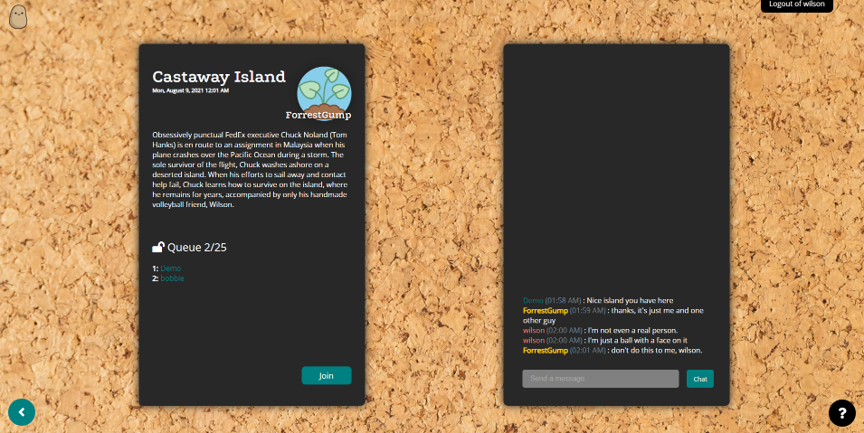
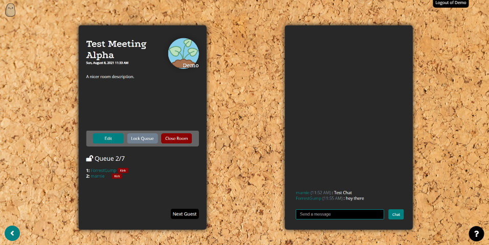
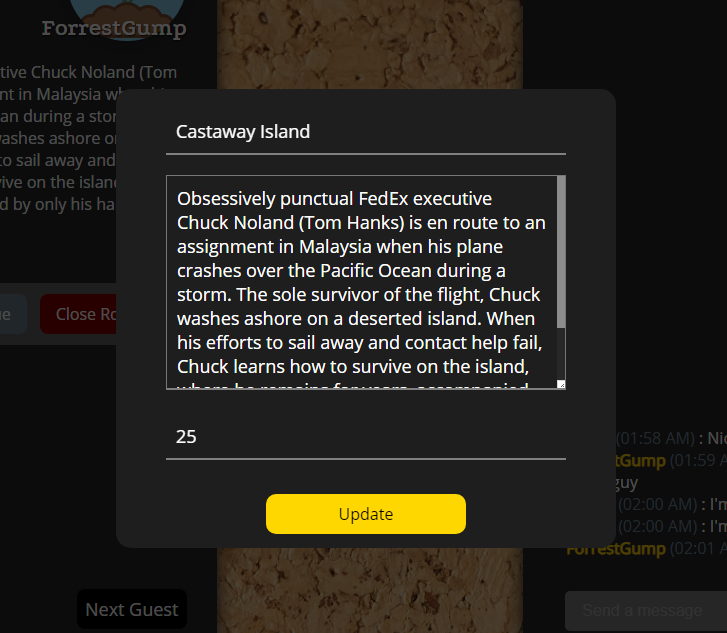
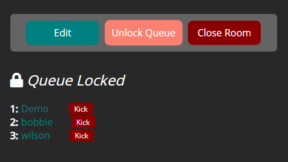
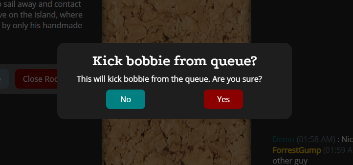
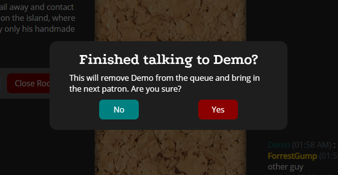
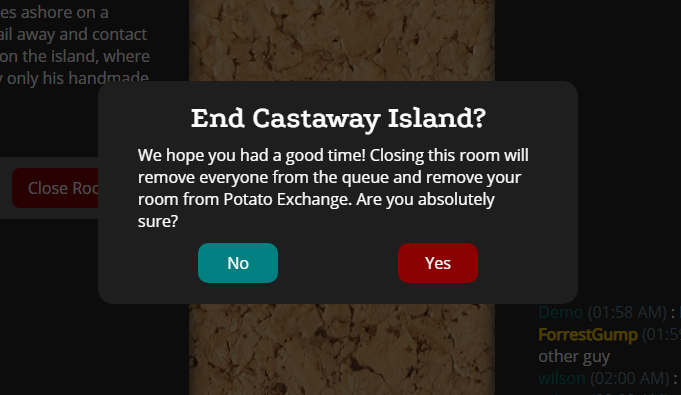

# Potato Exchange

## [potatoexchange.herokuapp.com]

---
## About
Potato Exchange is a platform loosely based off of [Turnip Exchange], an app for [Animal Crossing: New Horizons] players to post their island codes to allow other people to enter their islands via a queueing system. In ACNH, the goal is to exchange a fungible good (Turnips) for in-game currency (Bells) at the highest possible price. Potato Exchange's goal is to allow users to have small, personal virtual meet-and-greets with lobby hosts using a similar queueing system, but also adds a chatroom feature to be able to socialize with other fans in queue.

---
## Technologies
### Libraries used:
- [Flask](https://flask.palletsprojects.com/)
- [React.js](https://reactjs.org/)
- [SQLAlchemy](https://www.sqlalchemy.org/)
- [Alembic](https://alembic.sqlalchemy.org/en/latest/)
- [PostgreSQL](https://www.postgresql.org/)
- [Flask-WTForms](https://flask-wtf.readthedocs.io/)
- [SocketIO](https://socket.io/)
- [Flask-SocketIO](https://flask-socketio.readthedocs.io/en/latest/)
- [Gunicorn](https://gunicorn.org/)
- [eventlet](https://eventlet.net/)
- [lorem-text](https://pypi.org/project/lorem-text/)

---
## Wiki Pages
### [Feature List]
### [Database Schema]
### [Frontend Routes]
### [User Stories]
<!-- ### [API Routes] -->
---
### Redux Tree
  - Session: the session user
  - Meetings: list of hosted meetings
  - Messages: stored chat messages
  - Queue: joins of users and the meetings to which they are queued

### Deployment:
- [Heroku](https://www.heroku.com/)
- [Docker](https://www.docker.com/)

### Testing:
- [Postman](https://www.postman.com/)
- [Postbird](https://github.com/Paxa/postbird)

---
## App Features
### Homepage

Guests are greeted with a minimalistic homepage where they can jump right into hosting a meeting, joining an existing one, and user login/signup. The "?" has other information about me and my other projects.



### Joining Meetings

Available meetings are listed as summary cards. Queue saturation should update in real-time thanks to SocketIO. The "Host" card presents another opportunity for the user to host a meeting.

### Guest Meetings and Chat

Inside a meeting room, a regular user can see meeting details on the left, with a live chatroom on the right. Usernames are color-coded by self, host, and other users. You can also Join or Leave a meeting's queue as long as it's not locked.

### Meeting Management as the Host

As the Host, you're presented with an array of options: editing meeting information, locking and unlocking the queue, and closing the meeting.



You can also manage the queue by kicking individual users, or the patron first in line by clicking "Next Guest".



Relevant actions have confirmation dialogues to prevent accidents.


All these actions update live on other clients.


---
## Components
### Button
Since there are so many things to press, I constructed a Button component that's customizable through props.
```
export default function Button({
  action,
  paddingY,
  paddingX,
  width,
  height,
  borderRadius,
  btnColor,
  text,
  fontColor,
  fontSize
}) {

  let paddingStr = String(paddingY) + "px " + String(paddingX) + "px"
  return (
    <div className={styles.buttonContainer}>
      <div
        className={styles.button}
        onClick={action}
        style={{
          backgroundColor: btnColor,
          "padding": paddingStr,
          "width": width,
          "height": height,
          borderRadius,
        }}
        ></div>
      <div
        className={styles.buttonText}
        style={{
          "color": fontColor,
          fontSize: fontSize
        }}
        >{text}</div>
    </div>
  );
```
### Chat Messages
Chat messages are colored with checking some user params and then inserting the appropriate styles class with CSS Modules.
```
export default function ChatMessage({message}) {
  const timestamp = new Date(message['created_at']).toLocaleTimeString('en-US', { timeZone: 'PST', hour: '2-digit', minute: '2-digit' })

  const user = useSelector((state) => state.session.user)
  const user_id = user?.id
  const host_id = message?.meeting?.host_id
  const message_user_id = message?.user_id

  const usernameColor = (message_user_id, host_id, user_id) => {
    if (message_user_id === host_id) return styles.usernameHost
    else if (message_user_id === user_id) return styles.usernameCurrentUser
    else return styles.username
  }

  return (
    <div className={styles.chatRowContainer}>
      <p className={styles.chatRow}>
        <span className={usernameColor(message_user_id, host_id, user_id)}>
          {message?.user?.username}
        </span>
        {" "}
        <span className={styles.timestamp}>
          ({timestamp})
        </span>
        {" "}: {message?.message}</p>
    </div>
  )
}

```
### Meeting Host Button Array
The array of buttons available in the meeting when you're the Host check a slew of conditionals in order to render the right button state (using our Button component) as well as being hooked up to sockets and modals.

---
## Challenges
- This was my first attempt at implementing websockets in a project, and while the concept of a persistent connection made sense, it took some time to understand that making full use of them meant refactoring a lot of code to not immediately use regular API calls from the frontend.
- Deployment was especially challenging. The socket implementation worked fine locally during development, but completely crumbled when deployed to Heroku. It took a lot to get it to finally work, with steps including and not limited to: debugging through Heroku logs, making sure all dependencies were available, configuration changes, CORS modifications, modifying the Dockerfile, and checking for compatibility issues. Ultimately, it turned out that there was an extremely recent update to eventlet that caused conflicts with Gunicorn.
- Lots of little bugs around user authentication status kept popping up, and I'd need to play whack-a-mole with handling the logged-in and logged-out behavior of a lot of features.
- I had my wisdom teeth taken out during this project, so that really hindered my productivity.
---
## Future Additions
- Currently, namespaces aren't used in  the websocket implementation. This leads a huge space (no pun intended) for performance improvements, as emits are sent to everyone at this time.
- Queueing is implemented, but the user at the top of the queue doesn't really get to do anything special at this point. The plan is to implement webRTC so that that user can video-chat with the Host.
- Categorization and a Search feature for meetings would be a good usability feature.
- User profiles so that they can have avatar images, as well being able to modify personal information.

[Turnip Exchange]: https://turnip.exchange/

[potatoexchange.herokuapp.com]: https://potatoexchange.herokuapp.com

[Animal Crossing: New Horizons]: https://www.animal-crossing.com/new-horizons/

[Feature List]: https://github.com/PotatoAim11518/potato_exchange/wiki/MVP-Feature-List

[Database Schema]: https://github.com/PotatoAim11518/potato_exchange/wiki/Database-Schema

[Frontend Routes]: https://github.com/PotatoAim11518/potato_exchange/wiki/Frontend-Routes

[User Stories]: https://github.com/PotatoAim11518/potato_exchange/wiki/User-Stories

[API Documentation]: ./api-documentation
